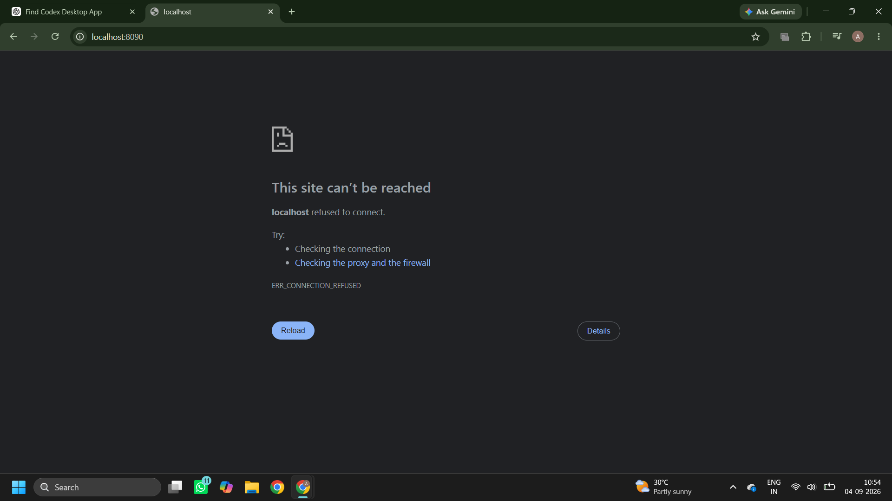
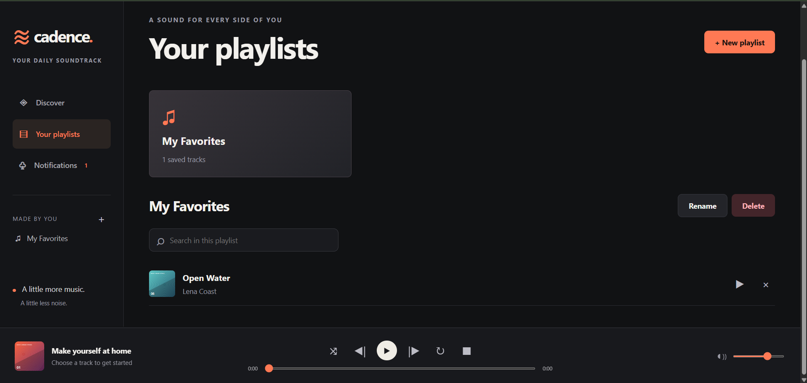
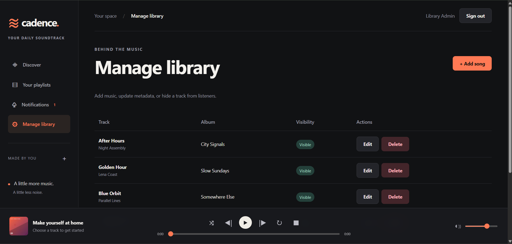
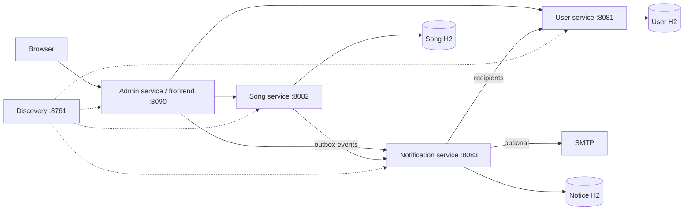

# Cadence — Music Library

A Java microservices music library with a responsive HTML/CSS/JavaScript frontend. Built for learning, demonstrating, and extending. All source files are included; no code generator or proprietary service is required to run it.

## Application preview

### Discover music

Browse and play the curated library through a responsive, accessible interface.



### Personal playlists

Signed-in listeners can create playlists, search within them and manage saved tracks.



### Library administration

Administrators can add and edit metadata, control track visibility and remove songs.



## Start on Windows

1. Extract the entire ZIP to a NEW folder, for example `Documents\cadence-complete`. Do not overwrite your earlier learning project. Prefer a folder outside OneDrive for the running database.
2. Open that folder in VS Code and trust the folder you extracted.
3. Double-click **Start.cmd**. It builds the services, generates local secrets and admin credentials, and starts five background Java processes. The first build needs internet access.
4. When it says ready, open **http://localhost:8090**. If discovery is still catching up, wait a few seconds and retry.
5. Register a normal account from **Sign in → Create an account**. For admin access, use the credentials in **.local/ADMIN-LOGIN.txt**.
6. Double-click **Stop.cmd** when finished. Songs, accounts, playlists and notifications remain in `data/`.

Java 25 JDK is required (you already have it). Maven Wrapper is included. No Node, MySQL, Eclipse or Docker installation is required. Allow roughly 2 GB of free memory for the five services plus your browser/editor.

The older project on port 8080 can remain separate. This project's UI runs on 8090. Do not start two copies of this project on the same ports.

## Features

- Register, login, logout with BCrypt passwords, signed JWTs, two-hour sessions and server-side logout revocation.
- Six original short demo instrumentals and geometric cover assets, usable offline after dependencies are downloaded.
- Browse songs; inspect artist, director, album and date; search across those fields; genre filters.
- Play, pause, stop, previous/next, seek, volume, repeat-one and shuffle.
- Multiple private playlists; create/rename/delete; add/remove songs; search within a playlist.
- Admin-only song create/read/update/delete; visibility controls enforced by the Song Service for list, search and individual fetches.
- In-app new-song notifications; optional SMTP email for users who opt in during registration.
- Persistent H2 databases, Eureka discovery, same-origin API gateway, request validation, role checks and playlist ownership checks.
- Responsive layout, keyboard focus styles, labeled controls, reduced-motion support, loading/error/empty states, safe text rendering and a restrictive Content Security Policy.

## Services and data ownership

| Module | Port | Responsibility |
|---|---:|---|
| discovery-server | 8761 | Eureka service registry |
| user-service | 8081 | Accounts, BCrypt passwords, login sessions, user-owned playlists |
| song-service | 8082 | Song metadata, visibility, sample library, durable notification outbox |
| notification-service | 8083 | Per-user in-app notices, idempotent event intake, SMTP retries |
| admin-service | 8090 | Frontend, same-origin API routing and admin access gate |
| common | — | Shared JWT/security configuration and API errors |

The Admin Service delegates metadata storage to the Song Service; it does not duplicate the song database. Both enforce admin authorization. Services call each other through Eureka-resolved logical names. Session revocation checks use a direct local User Service address so JWT validation does not depend on registry refresh. The Song Service's durable outbox retries notification requests if the Notification Service is down.



## Frontend files

All frontend code is in **admin-service/src/main/resources/static/**:

- `index.html`: page structure, forms, dialogs, player controls.
- `styles.css`: colors, typography, layout, responsive breakpoints, motion.
- `app.js`: authentication, API requests, search, playlists, admin actions, notifications, audio player.
- `assets/`: six original SVG covers and six original 24-second WAV demos.

The application uses Fetch API and ordinary HTML/CSS/JavaScript. JSP is deliberately unnecessary: browser rendering is separate from REST APIs, and the frontend is served from the gateway's executable JAR. Your requested Java/Spring microservices remain the backend.

## Email setup (optional)

In-app notices work without SMTP. Real email is OFF by default; the app does not pretend to send it.

After the first start, stop the services and edit `.local/settings.json`. Add your provider's real settings (all values are strings):

```json
{
  "MUSIC_EMAIL_ENABLED": "true",
  "MUSIC_EMAIL_FROM": "your-verified-sender@example.com",
  "MUSIC_SMTP_HOST": "your-smtp-host",
  "MUSIC_SMTP_PORT": "587",
  "MUSIC_SMTP_USERNAME": "your-smtp-username",
  "MUSIC_SMTP_PASSWORD": "your-provider-app-password",
  "MUSIC_SMTP_AUTH": "true",
  "MUSIC_SMTP_TLS": "true"
}
```

Merge these into the existing object; preserve the generated JWT/internal/database/admin values. Never commit this file. Restart, register a user with email opt-in, then add a visible song as admin. Notifications are queued for users registered at event delivery time. Initial seed songs do not trigger notifications. Retry intervals are 15 seconds for outbox events and 30 seconds for email. SMTP is retried up to five attempts; delivery may be duplicated if a provider accepts a message but the acknowledgement is lost. Unhiding a song also sends a release notice. Historical notices remain even if a song is later hidden; playback rechecks availability.

## Development

Run `mvnw.cmd package` from the root to compile every module. The launcher rebuilds on every start. For an already built checkout, use `powershell -NoProfile -ExecutionPolicy Bypass -File scripts/Start.ps1 -NoBuild`.

Configuration files are in each service's `src/main/resources/application.properties`. Database paths are relative to the project root because the launcher starts every process there. Keep `.local/settings.json` with `data/`: losing the generated database password can prevent opening the database. Back up both privately while services are stopped. The launcher never deletes data.

Admin credentials are created only when the admin email does not yet exist. Changing the password setting later does not overwrite an existing account password. Use a new local test database/account deliberately if you need to reset a forgotten demo admin account.

See **FILE-GUIDE.md** for every file's location and purpose, **API.md** for routes, and **VERIFICATION.md** for the checks actually performed on this delivery.

## Troubleshooting

- **Port in use:** run this project's Stop.cmd. The launcher refuses to stop unrelated processes.
- **Services fail to start:** inspect `logs/<service>.log` and `.error.log`. Check Java 25 and free memory. Run Stop.cmd before retrying.
- **503 immediately after startup:** wait for Eureka discovery to refresh, then retry. Check all five health endpoints.
- **401 after two hours:** sign in again. Signing out invalidates the current token on the server.
- **No sound:** click play (browsers require user interaction). Check volume. External audio must be a directly playable HTTPS URL, not a YouTube/Spotify page, and its host must permit playback.
- **Hidden/deleted track in a playlist:** the playlist keeps its song ID but shows unavailable. Remove that entry or make the track visible again.
- **Blank email:** email needs real SMTP settings and an opted-in recipient. In-app notifications are independent.
- **Warnings mentioning Unsafe:** Maven may print Java runtime warnings; look for BUILD SUCCESS or BUILD FAILURE to determine the build result.

## Before public hosting

This delivery is a local portfolio project, not a hosted production system. Services bind to loopback by default. Public hosting requires HTTPS, private service networking, secret management, durable managed databases and backups, email verification/password recovery, rate limits, media hosting, production migrations (replace `ddl-auto=update`), monitoring and deployment-specific URLs. The gateway and every API already enforce roles and ownership; do not remove those checks to deploy.

JWTs are stored in sessionStorage for a single browser tab and cleared on sign-out. For a production browser deployment, consider an HttpOnly cookie/BFF session with CSRF protection. Audio URLs are public media links: hiding a song hides its metadata and blocks new player requests but does not revoke an already known media URL or stop a stream already downloaded. Strong private media access requires signed URLs or an authenticated media server.

The app sends full replacements for PUT song updates. Media upload, streaming transcoding, password recovery and email verification are not included. Sample tracks are short original synthesized demos, not commercial recordings.

Compatibility sources: [Spring Cloud matrix](https://spring.io/projects/spring-cloud/) (2025.1.2 supports Spring Boot 4.1.x), [Spring Boot docs](https://docs.spring.io/spring-boot/). Dependencies are pinned in the root POM.
